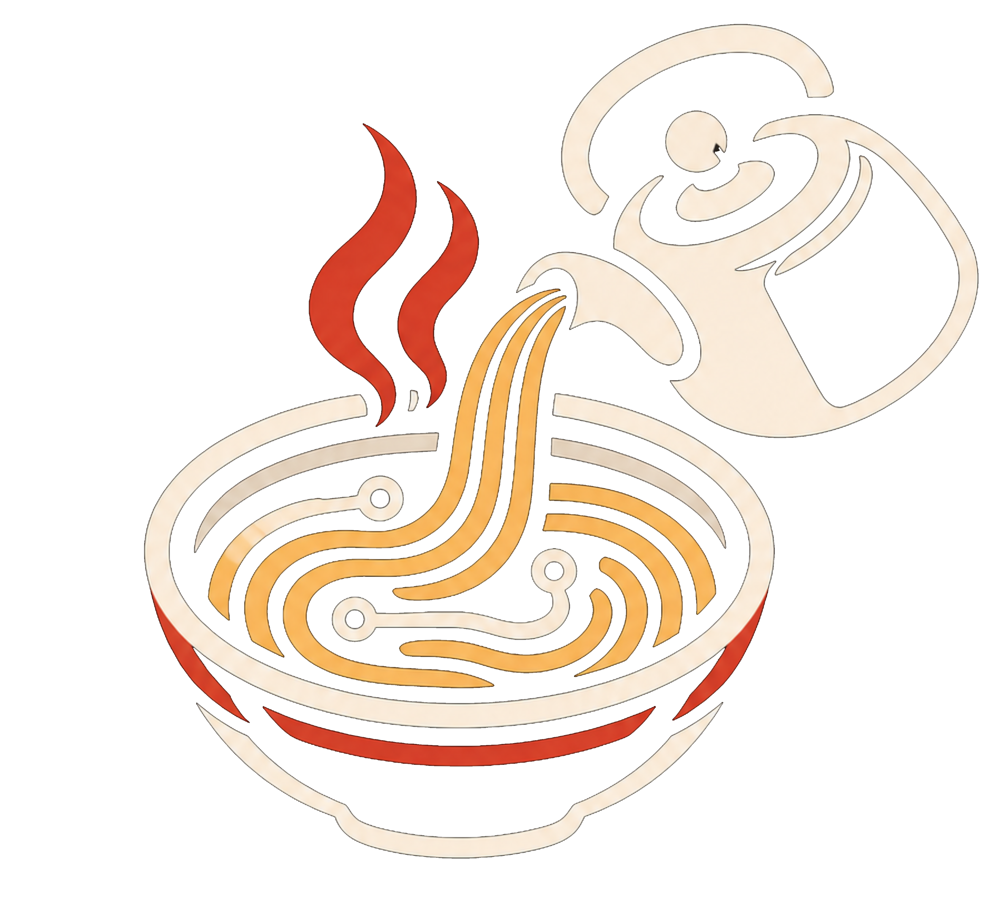
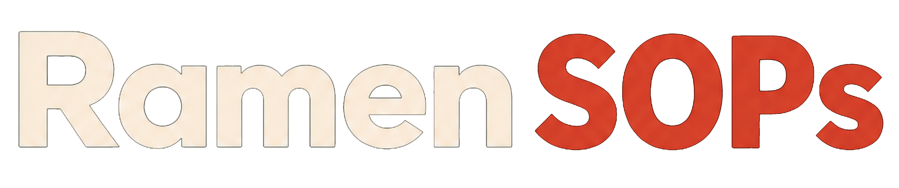

<div align="center"></div>
<div align="center"></div>

The public registry of general-purpose **SOPs** (standard operating procedures) for
[Rameness](https://github.com/Prog-Ramen/Rameness): the JEV-driven agent harness.

An SOP is a tested, parameterised procedure an agent can run instead of re-deriving the same
steps. Rameness learns SOPs from repeated work, keeps them private by default, and only
general ones - scanned for secrets and reviewed by maintainers - are merged here.

## Layout

```
sops/
  index.json                   top-level categories only (+ aliases of moved SOPs)
  _aliases.json                old SOP id -> new id, for SOPs moved by a reorganization
  <category>/_index.json       that category's children: sub-categories, and SOPs by id,
                               description and keywords only
  <category>/_node.json        category description, keywords, requirements
  <category>/<name>/sop.json   interface: description, inputs (JSON schema), permissions, tests
  <category>/<name>/_meta.json generated: inputs, permissions, per-file SHA-256 (pinned by the listing)
  <category>/<name>/run.py     implementation: JSON args on stdin -> JSON result on stdout
```

The registry works like a Dremel serving tree, so clients never download or scan the whole registry:

- **Sharded:** every category has its own small listing, fetched only when a client explores it.
- **Columnar:** a listing carries only what a client chooses by. An SOP's inputs, permissions and file hashes
  are in its `_meta.json`, fetched only for the SOPs the client picks, and checked against the hash in the
  listing.
- **Small at every level:** no category holds more than 8 SOPs directly. A proposal that would push a category
  over the limit splits it into subcategories in the same PR: Rameness's model proposes the groups and Kev
  confirms each member before it pushes. Moved SOPs are unchanged except for their id and keep their old ids
  as aliases. `sop-check` fails a PR that leaves a category it adds to crowded, and a PR that moves SOPs needs
  a maintainer.

`main` holds only the SOPs; the generated files (`index.json`, `_index.json`, `_meta.json`) are built after
every merge and published, with the SOPs, to the `registry` branch that Rameness pulls from.

How it all fits together, with diagrams of the review, merge and publishing flow, is in
[docs/architecture.md](docs/architecture.md).

## Use

Rameness pulls from this registry on its own, and only what a task needs. When no local SOP
covers a task, JEV walks this tree lazily with its normal activation criteria: it fetches a
category's `_index.json` only when it explores that branch, downloads only the SOPs it selects,
verifies every file's hash, and keeps an SOP only if its tests pass. SOPs that need permissions
beyond your allowed set are pulled only with your approval.

```bash
rameness sop pull text.slugify      # pull one SOP (walks only its ancestors' listings)
rameness sop remote "slugify a title"
```

## Contribute

Propose SOPs from Rameness with `rameness sop propose <id>`. It opens a PR here, from a fork if you
can't push. The PR is public as soon as it is pushed, so Rameness checks first: secrets and your
organization's `private_terms` always block; JEV judges other findings (emails, private hosts,
home paths) and refuses anything it thinks exposes private info. Every SOP must be general (no
organization-specific endpoints, names or data), contain no secrets, and pass its tests.

## Automated review and merging

Every SOP PR runs `sop-check` and `secret-scan`. Once both pass for the same commit,
`sop-merge` independently reads that commit using the trusted policy on `main`, reviews its
usefulness with runner-local Kev-4B, and squash-merges it only if all criteria pass. It comments
with the decision and uses `sop:auto-merge`, `sop:needs-human`, `sop:checking`,
`sop:checks-failed` or `sop:reviewer-error` to distinguish policy decisions from infrastructure failures. Failed, uncertain
or unavailable reviews never authorize a merge. The merge decision also retries every 15 minutes.

The automatic criteria are:

- A validated public Python script under `sops/<category>/<name>/`, with its matching ID,
  a useful description, a parameterized input schema, and declared permissions.
- A meaningful, repeatable operation that is reusable across people and organizations;
  implementation matches its description, without private configuration, secrets,
  hard-coded answers, prompt injection or duplicate boilerplate.
- At least two distinct inputs with concrete expected values, covering normal and edge
  behavior. Important optional behavior must also be tested. Key-only and error-only
  assertions cannot establish eligibility, but they ship and run with the rest:
  `expect_keys` (required output keys) and `expect_error: true` (the SOP must fail).
  JSON file outputs can use `expect_files`.
- A test may bring fixtures: `files` (relative path -> text, at most 50 files / 256 KB) and
  `setup` (Python, at most 8 KB, that builds anything else, e.g. binary files). They are
  created in the test's scratch directory before the SOP runs, inside the same sandbox.
- Every test passes in a fresh resource-limited, non-root container with no network,
  credentials, host write mounts or Docker socket. Its scratch directory is discarded.
- Only `compute`, `fs:read` and `fs:write` permissions, with visible file operations declared;
  standard-library imports and no dynamic execution or introspection. Network access,
  command execution, side effects, skills, composites and ambiguous cases require a maintainer.
- Updates retain every original test, pass them against the new implementation, change
  version, and preserve the input schema, kind and permissions. Breaking interface changes,
  deletions and changes outside `sops/` require a maintainer.
- The PR is current with `main`, and both successful workflow runs belong to its exact
  head commit. GitHub branch protection requires `review` and `scan`; the merge API also
  atomically rejects a changed PR head.

The AI review is an additional quality check, not a proof of correctness or security.
Mechanical checks, isolated tests, secret scanning and branch protection remain mandatory.

| Workflow | Purpose |
|---|---|
| `sop-check` | Trusted policy reads PR blobs as data and executes SOP tests only in isolated containers. |
| `secret-scan` | Pinned, checksum-verified Gitleaks scans PR commit history using trusted default rules, including intermediate commits. No organization license or API secret required. |
| `sop-merge` | Runs only from `main`; verifies both checks, reviews SOP quality and merges an unchanged eligible revision. Never executes SOP code. |
| `registry-index` | Builds metadata and SHA-256 indexes without executing SOP code, publishing the `registry` branch after each merge and hourly. |

The trusted merge job runs pinned Kev-4B locally on a standard Ubuntu runner in CPU BF16
storage mode, with FP32 linear arithmetic performed one layer at a time to avoid slow
emulated BF16 operations while keeping the original weights and bounded memory use.
It downloads the pinned Kev adapter and Qwen base once into a verified Hugging Face
cache and restores that cache on later jobs. No OpenAI API key or externally hosted model
is required. Source, model revisions and dependencies are pinned; restored weights are
checked against the pinned Hub metadata before use. Oversized input is rejected instead of
silently truncated. Missing/invalid model answers, startup failures or uncertainty block merging.

The initial quality policy requires all five scores >= 0.70. Security requires all four risk
scores <= 0.30; a model suspicion holds the PR rather than automatically closing it. These
thresholds were smoke-tested against a valid JSONL audit and four obvious bad examples,
not calibrated on a broad adversarial SOP dataset. Deterministic secret/private/destructive
findings still trigger guarded automatic closure and branch cleanup. Kev does not provide
line-level evidence to justify a model-only accusation.

Only model files are cached, with a 9 GiB budget to stay below GitHub's included 10 GiB
repository allowance. This workflow does not increase cache limits or enable paid runners.
Other repository caches still count toward that allowance. Cache eviction means a future
run may download again. Setup and review run only from trusted main; PR smoke benchmarks
have read-only permissions and never save caches. Model startup is skipped when no open
proposal branches exist. The optional OpenAI implementation remains available to callers
that select its backend explicitly; the deployed workflow selects Kev.

The reviewer caches a completed semantic decision only for the same head commit, model
and policy hash. API failures are retried. A scheduled merge pass recovers missed events.
Diagnostic manual runs of `sop-check`/`secret-scan` do not replace the mandatory PR checks.

### Prohibited submissions

The trusted merge job scans secrets independently, even after a failed check. Secret findings,
explicit private metadata or distribution restrictions, and detected filesystem-root deletion
cause rejection. Other suspicious submissions are held when Kev flags malicious/private/
non-public behavior or prompt injection. Kev scores do not substantiate line-level evidence
for an automatic closure; reviewer errors also block merging. The optional OpenAI backend
requires two evidence-grounded review contexts for model-based rejection.

Confirmed prohibited submissions are closed. Only an unchanged, exclusively owned `sop/`
branch in this repository is deleted, using an atomic lease; forks and shared branches require
owner follow-up. Reports omit credential values and private snippets. Deleting a branch does
not erase retained PR refs, cached copies or forks. Exposed credentials require revocation,
and complete removal can require GitHub Support. Model reviews and static rules cannot
prove provenance or eliminate obfuscated malicious behavior.

### Repository settings

Require the `review` and `scan` status checks on `main`, with branches up to date before
merging. Do not require a manual approval for automatically eligible SOPs. Maintainers can
review and merge `sop:needs-human` PRs once their applicable checks pass. Keep Actions'
default token read-only; each workflow declares the additional permissions it needs.
The pipeline uses a direct guarded merge and does not depend on GitHub's auto-merge toggle
or on allowing bots to approve pull requests. Leave `registry` writable by the index job.

### Develop the gate

```bash
python -m unittest discover -s tests -v
python ci/review.py --repo . --base origin/main --head HEAD \
  --json /tmp/verdict.json --markdown /tmp/review.md
```

Add `--execute` to run the Docker-isolated tests. The standalone CI gate has no dependency
on unpublished Rameness code. Local `rameness sop review` remains a separate preflight;
GitHub CI is the authoritative merge policy.

Kev review requests have a 30-minute timeout each. The quality and security requests run sequentially; the workflow has a 75-minute limit to allow both requests plus setup. An isolated 2,460-token JSONL quality review completed in 9 minutes 33 seconds on the standard CPU runner. Timeouts continue to block automatic merging.
