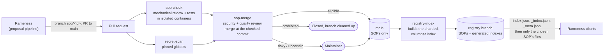
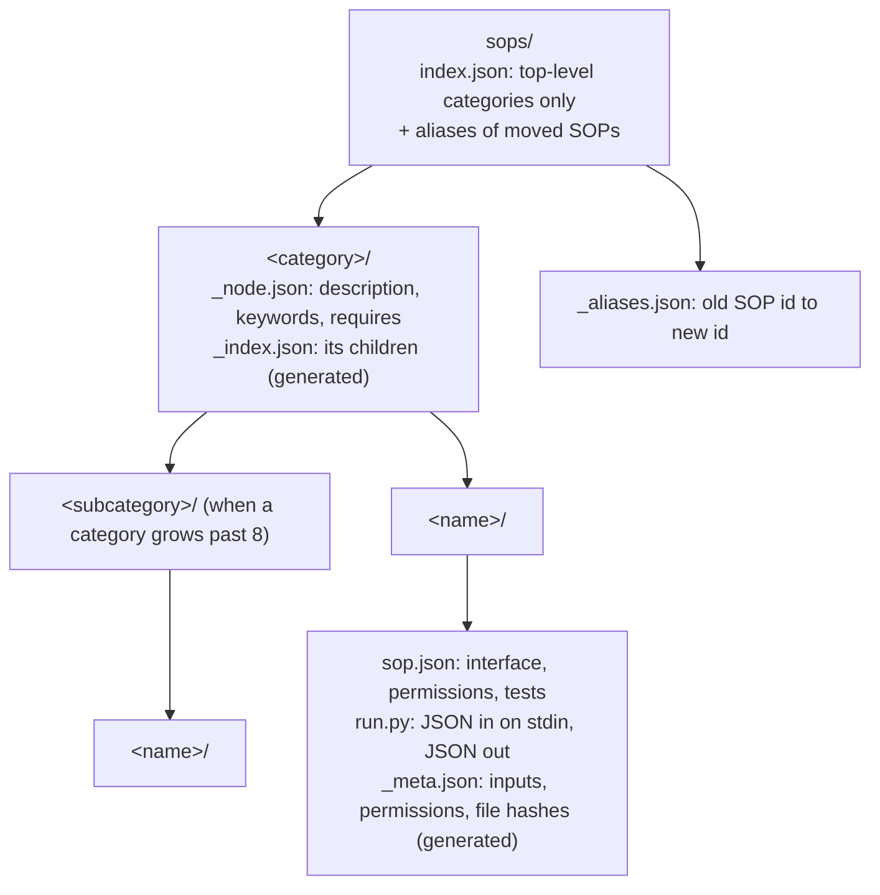
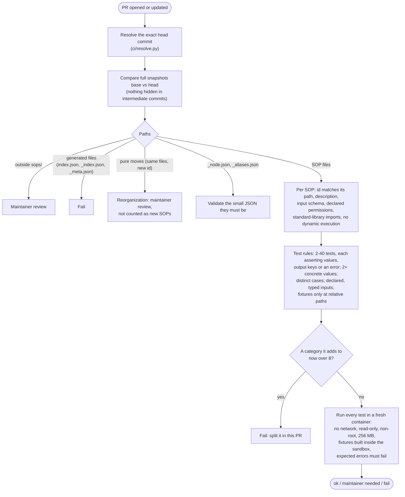
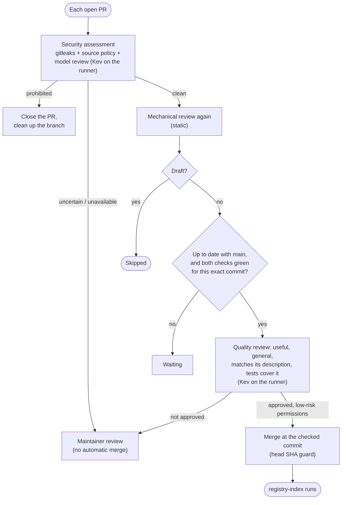
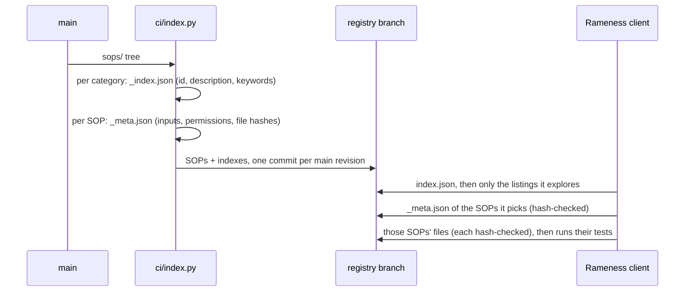

# Architecture

**In brief:** RamenSOPs is a Git repository of tested procedures (SOPs) plus the CI that guards it. Proposals
arrive as pull requests (usually opened by Rameness), pass mechanical checks, isolated tests, secret scanning
and a model review, and merge at the exact commit that was checked. After every merge a sharded, columnar index
is published to the `registry` branch, which Rameness reads one small listing at a time.

## The whole flow

From a proposal to an SOP another agent can pull.



## The tree and its files

SOPs live in a category tree; every level stays small, like a Dremel serving tree.



* **Sharded:** a client fetches a category's listing only when it decides to look inside it.
* **Columnar:** a listing holds only what a client chooses by (id, description, keywords). The rest is in the
  SOP's `_meta.json`, fetched only for the SOPs a client picks, and pinned by its hash in the listing.
* **Small at every level:** no category holds more than 8 SOPs directly. A proposal that would push one over
  splits it into subcategories in the same PR; moved SOPs keep their old ids as aliases.

## sop-check: reviewing a proposal

Runs on every PR with the trusted copy of the CI from `main`; it reads the PR's files as data.



## sop-merge: deciding and merging

Runs after `sop-check` and `secret-scan` finish, and every 15 minutes; it never runs a PR's code.



Eligible for automatic merge: Python SOPs with `compute`, `fs:read` or `fs:write` permissions. Anything with
`network`, `exec` or side effects, skills, composites, reorganizations and changes outside `sops/` need a
maintainer.

## registry-index: publishing

After every merge to `main` (and hourly), `ci/index.py` builds the indexes without importing any SOP code and
force-publishes `sops/` with them to the `registry` branch, which is what Rameness reads.



## Code map

```
ci/
  review.py       mechanical review: paths, metadata, permissions, test rules, moves, crowding; runs tests in containers
  run_test.py     container-side test runner: builds fixtures, runs the SOP, checks expected errors and written files
  resolve.py      the exact PR head to review
  security.py     secret scan + source policy + model security review; closes prohibited PRs
  semantic.py     quality review (usefulness, generality, implementation, coverage)
  kev_*.py        runner-local Kev: setup, pinned weights, server, readiness, reviews, benchmark
  merge.py        the merge loop: re-check each open PR, merge eligible ones at their checked commit
  index.py        sharded, columnar index builder (no SOP code is imported)
tests/            tests of the CI itself
sops/             the SOPs
.github/workflows/
  sop-check.yml        review + container tests on every PR
  secret-scan.yml      pinned gitleaks on every PR and push
  sop-merge.yml        security + quality review and merge
  registry-index.yml   publish the registry branch
  kev-benchmark.yml    benchmark the CI's Kev when its setup changes
```

The client side (how Rameness proposes, places and pulls SOPs) is described in
[Rameness' architecture](https://github.com/Prog-Ramen/Rameness/blob/main/docs/architecture.md).
